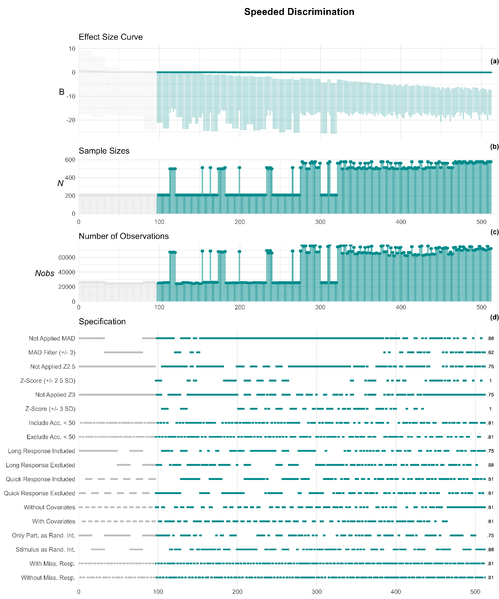

Authors: [Victor Auger](mailto:victor.auger.ac@gmail.com), Céline Darnon, Alice Normand

PDF: [Final Version @ Collabra](https://online.ucpress.edu/collabra/article/11/1/147545/214962/Is-Perceived-Economic-Scarcity-Linked-to-Attention)

---

## Abstract

This research investigates how perceived economic scarcity is associated with heightened sensitivity to economic inequality-related cues. Across three preregistered studies, participants completed a speeded-decision (N = 580 and N = 206) and a change-blindness task (N = 210). We hypothesized that perceived economic scarcity would be associated with heightened attention to inequality-related cues. Results from Study 1 and 2 provided partial support of increased attention to information related to how resources are distributed. However, results from Study 3, using a more ecologically valid paradigm, are not consistent with our hypothesis. A multiverse analysis revealed that core findings were robust across specifications. These results offer a potential cognitive explanation of how economic inequality can act as a catalyst for individuals experiencing scarcity, through increased attentional tuning to economically salient features in the environment

## Citation

Victor Auger, Céline Darnon, Alice Normand; Is Perceived Economic Scarcity Linked to Attention Toward Economic Inequality Cues? Empirical Evidence With Multiverse Analyses. _Collabra: Psychology, 11_(1). https://doi.org/10.1525/collabra.147545
```bibtex
@article{10.1525/collabra.147545,
    author = {Auger, Victor and Darnon, Céline and Normand, Alice},
    title = {Is Perceived Economic Scarcity Linked to Attention Toward Economic Inequality Cues? Empirical Evidence With Multiverse Analyses},
    journal = {Collabra: Psychology},
    volume = {11},
    number = {1},
    pages = {147545},
    year = {2025},
    month = {12},
    abstract = {This research investigates how perceived economic scarcity is associated with heightened sensitivity to economic inequality-related cues. Across three preregistered studies, participants completed a speeded-decision (N = 580 and N = 206) and a change-blindness task (N = 210). We hypothesized that perceived economic scarcity would be associated with heightened attention to inequality-related cues. Results from Study 1 and 2 provided partial support of increased attention to information related to how resources are distributed. However, results from Study 3, using a more ecologically valid paradigm, are not consistent with our hypothesis. A multiverse analysis revealed that core findings were robust across specifications. These results offer a potential cognitive explanation of how economic inequality can act as a catalyst for individuals experiencing scarcity, through increased attentional tuning to economically salient features in the environment.},
    issn = {2474-7394},
    doi = {10.1525/collabra.147545},
    url = {https://doi.org/10.1525/collabra.147545},
    eprint = {https://online.ucpress.edu/collabra/article-pdf/11/1/147545/912613/collabra_2025_11_1_147545.pdf},
}

