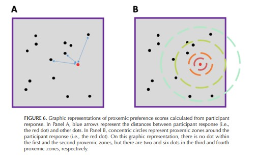

Authors: Rhea Haddah, [Victor Auger](mailto:victor.auger.ac@gmail.com), Lucas Gautier

PDF: [Final Version @ SocCog](https://guilfordjournals.com/doi/10.1521/soco.2025.43.3.238)

Shiny app: [here](https://tjw41q-victor0auger.shinyapps.io/CPP_Shiny/)

---

## Abstract

The way individuals and groups of individuals choose to physically position themselves in social spaces is not random. It is determined by sociopsychological factors such as group membership or demographics. Spatial dynamics are therefore indicators of underlying social and cognitive processes. Existing research methods and paradigms used to uncover social dynamics through controlled, repeated, and psychometrically valid measures of spatial indicators are rare. To overcome these limitations, a new tool has been developed and tested: the crowd placement paradigm (CPP). This article is a step-by-step tutorial aiming to present this novel paradigm with comprehensive instructions on how to implement it and detailed information on the associated accessible resources that will facilitate its adoption by interested researchers. Furthermore, examples based on previously conducted studies are provided to present how paradigm parameters can be manipulated and adapted to explore a variety of research questions. This article highlights the CPP's potential uses in social cognition research.

## Citation

Haddad, R., Auger, V., & Gautier, L. (2025). The crowd placement paradigm: Introducing a novel tool to study sociospatial dynamics. _Social Cognition, 43_(3), 238-256.

```bibtex
@article{doi:10.1521/soco.2025.43.3.238,
author = {Haddad, Rhea and Auger, Victor and Gautier, Lucas},
title = {The Crowd Placement Paradigm: Introducing a Novel Tool to Study Sociospatial Dynamics},
journal = {Social Cognition},
volume = {43},
number = {3},
pages = {238-256},
year = {2025},
doi = {10.1521/soco.2025.43.3.238},
URL = {https://doi.org/10.1521/soco.2025.43.3.238},
eprint = {https://doi.org/10.1521/soco.2025.43.3.238},
abstract = {The way individuals and groups of individuals choose to physically position themselves in social spaces is not random. It is determined by sociopsychological factors such as group membership or demographics. Spatial dynamics are therefore indicators of underlying social and cognitive processes. Existing research methods and paradigms used to uncover social dynamics through controlled, repeated, and psychometrically valid measures of spatial indicators are rare. To overcome these limitations, a new tool has been developed and tested: the crowd placement paradigm (CPP). This article is a step-by-step tutorial aiming to present this novel paradigm with comprehensive instructions on how to implement it and detailed information on the associated accessible resources that will facilitate its adoption by interested researchers. Furthermore, examples based on previously conducted studies are provided to present how paradigm parameters can be manipulated and adapted to explore a variety of research questions. This article highlights the CPP's potential uses in social cognition research. }
}
