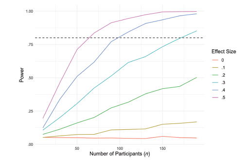

Authors: [Victor Auger](mailto:victor.auger.ac@gmail.com), Alice Normand

PDF: [Final Version @ IJP](https://onlinelibrary.wiley.com/doi/10.1002/ijop.13238)

Shiny app: [here](https://tjw41q-victor0auger.shinyapps.io/Sim_shinny112/)

---

## Abstract

Simulation has become an essential tool in psychological research, offering unique insights into statistical concepts, optimising research project planning and modelling human behaviour and cognition. This tutorial navigates simulations' diverse applications across various research stages. This tutorial begins by demonstrating simulations' impact on understanding statistical concepts. Amidst growing demands for effect size reporting and interpretation, simulations can help clarify the relationship between data and effect sizes, benefiting both educational purposes and advanced research. Simulations play a crucial role in planning psychological research. They provide flexible solutions for power, helping to determine necessary sample sizes and aiding in robust research planning, providing evidence of planned procedures. Simulations are pivotal in exploring human behaviour and cognition, as well as statistical method properties. By forcing researchers to translate verbal theory into formal models, simulation can help specify the assumptions. The paper also discusses improving simulation efficiency, such as using calculation clusters, optimising simulation practices and recognises simulations' limitations. This paper emphasises simulations' versatile role in psychological research. They enable deep insights into complex datasets, streamline project preparation and uncover subtleties in human behaviour, cognition and statistical methodologies.

## Citation

Auger, V. and Normand, A. (2024), Data simulations for advancing psychological research: Insights, preparations and investigations. _Int J Psychol, 59_: 1168-1182. https://doi.org/10.1002/ijop.13238

```bibtex
@article{https://doi.org/10.1002/ijop.13238,
author = {Auger, Victor and Normand, Alice},
title = {Data simulations for advancing psychological research: Insights, preparations and investigations},
journal = {International Journal of Psychology},
volume = {59},
number = {6},
pages = {1168-1182},
keywords = {Modelling, Data simulations, Statistical power, Methods},
doi = {https://doi.org/10.1002/ijop.13238},
url = {https://onlinelibrary.wiley.com/doi/abs/10.1002/ijop.13238},
eprint = {https://onlinelibrary.wiley.com/doi/pdf/10.1002/ijop.13238},
abstract = {Simulation has become an essential tool in psychological research, offering unique insights into statistical concepts, optimising research project planning and modelling human behaviour and cognition. This tutorial navigates simulations' diverse applications across various research stages. This tutorial begins by demonstrating simulations' impact on understanding statistical concepts. Amidst growing demands for effect size reporting and interpretation, simulations can help clarify the relationship between data and effect sizes, benefiting both educational purposes and advanced research. Simulations play a crucial role in planning psychological research. They provide flexible solutions for power, helping to determine necessary sample sizes and aiding in robust research planning, providing evidence of planned procedures. Simulations are pivotal in exploring human behaviour and cognition, as well as statistical method properties. By forcing researchers to translate verbal theory into formal models, simulation can help specify the assumptions. The paper also discusses improving simulation efficiency, such as using calculation clusters, optimising simulation practices and recognises simulations' limitations. This paper emphasises simulations' versatile role in psychological research. They enable deep insights into complex datasets, streamline project preparation and uncover subtleties in human behaviour, cognition and statistical methodologies.},
year = {2024}
}
