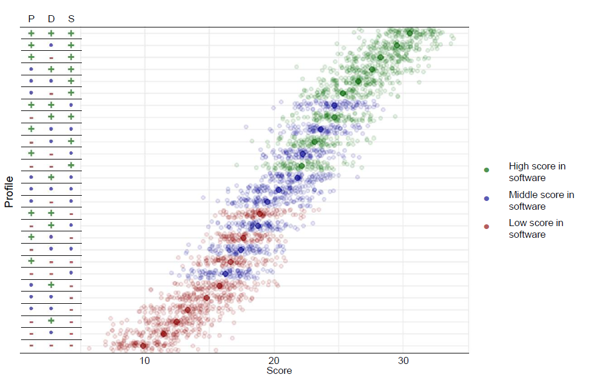

Authors: [Victor Auger](mailto:victor.auger.ac@gmail.com), Nele Claes

PDF: [Final Version @ MP](https://open.lnu.se/index.php/metapsychology/article/view/3779/3590)

---

## Abstract

In target papers, Schönbrodt et al. (2022), and Gärtner et al. (2022) proposed to broaden the range of the considered research contributions, namely (i) bringing strong empirical evidence, (ii) building open databases, (iii) building and maintaining packages, where each dimension being scored independently in marking scheme. Using simulations, we show that the current proposal places a significant weight on software development, potentially at the expense of other academic activities – a weight that should be explicit to committees before they make use of the proposed marking scheme. Following Gärtner et al. (2022) recommendations, we promote the use of flexible weights which more closely match an institution’s specific needs by the weighting of the relevant dimensions. We propose a Shinyapp that implement the marking scheme with adaptative weights to both help the hiring committee define and foresee the consequences of weights’ choices and increase the transparency and understandability of the procedure.

## Citation

Auger, V., Sommet, N., & Normand, A. (2024). The Perceived Economic Scarcity Scale: A valid tool with greater predictive utility than income. _British Journal of Social Psychology, 63_, 1112–1136. https://doi.org/10.1111/bjso.12719

```bibtex
@article{https://doi.org/10.15626/MP.2023.3779,
author = {Auger, Victor and Claes, Nele},
title = {Comment on "Responsible Research Assessment: Implementing DORA for hiring and promotion in psychology”},
journal = {Meta-Psychology},
volume = {8},
number = {},
pages = {},
keywords = {Research Assessment, Simulation-based Approach, Open Science},
doi = {[https://doi.org/10.1111/bjso.12719](https://doi.org/10.15626/MP.2023.3779)},
url = {https://open.lnu.se/index.php/metapsychology/article/view/3779},
eprint = {https://open.lnu.se/index.php/metapsychology/article/view/3779},
year = {2024}
}
```
