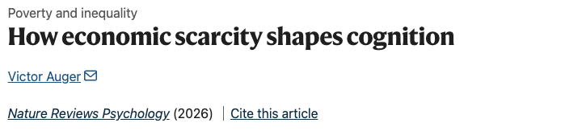

Author: [Victor Auger](mailto:victor.auger.ac@gmail.com)

PDF: [Final Version @ Nature Reviews Psychology](https://www.nature.com/articles/s44159-026-00611-9)

---

## Abstract

Financial problems rarely stay on the spreadsheet; people carry them throughout the day in their thoughts and worries. This is especially true for individuals facing poverty, who, with limited resources, face hard-to-resolve budgetary trade-offs. Thus, a central question is the extent to which financial concerns shape cognition and the way people perceive the world. In 2013, Mani and colleagues explored this question by combining laboratory and field studies...

## Citation

Auger, V. How economic scarcity shapes cognition. _Nat Rev Psychol_ (2026), https://doi.org/10.1038/s44159-026-00611-9.

```bibtex
@ARTICLE{Auger2026-hd,
  title     = "How economic scarcity shapes cognition",
  author    = "Auger, Victor",
  journal   = "Nat. Rev. Psychol.",
  publisher = "Springer Science and Business Media LLC",
  month     =  aug,
  year      =  2026,
  copyright = "https://www.springernature.com/gp/researchers/text-and-data-mining",
  language  = "en"
}
```
