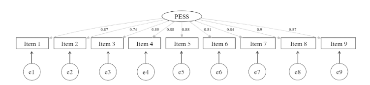

Authors: [Victor Auger](mailto:victor.auger.ac@gmail.com), Nicolas Sommet, Alice Normand

PDF: [Accepted Version @ BJSP](https://hal.science/hal-04390018)

---

## Abstract

This article introduces the Perceived Economic Scarcity Scale (PESS), a novel instrument measuring the subjective evaluation and experience of economic scarcity (the feeling of having insufficient financial resources to meet one's needs). We conducted three high-powered preregistered studies (total N = 1900) to rigorously evaluate the PESS's psychometric properties. In Study 1, we generated a pool of items and used both Principal Component Analysis and Exploratory Factor Analysis to select the most appropriate items. In Study 2, we examined the PESS's construct validity, demonstrating that it measures a distinct construct from related constructs such as subjective social class. In Study 3, we examined the PESS's predictive validity, demonstrating that it is a robust predictor of both affective outcomes (e.g. anxiety-depressive symptoms) and cognitive outcomes (e.g. economic risk-taking). Critically, we found that the PESS not only has incremental validity over and above income but also has greater predictive utility than income. We also found that the PESS score varies depending on the distance-to-pay and has excellent test–retest reliability. Overall, the PESS appears to be a valid and reliable instrument for assessing perceived economic scarcity, and we encourage researchers to use it to better understand the psychological consequences of ‘not having enough’.

## Citation

Auger, V., Sommet, N., & Normand, A. (2024). The Perceived Economic Scarcity Scale: A valid tool with greater predictive utility than income. _British Journal of Social Psychology, 63_, 1112–1136. https://doi.org/10.1111/bjso.12719

```bibtex
@article{https://doi.org/10.1111/bjso.12719,
author = {Auger, Victor and Sommet, Nicolas and Normand, Alice},
title = {The Perceived Economic Scarcity Scale: A valid tool with greater predictive utility than income},
journal = {British Journal of Social Psychology},
volume = {63},
number = {3},
pages = {1112-1136},
keywords = {income, risk and time preferences, scale validation, subjective economic scarcity, subjective well-being},
doi = {https://doi.org/10.1111/bjso.12719},
url = {https://bpspsychub.onlinelibrary.wiley.com/doi/abs/10.1111/bjso.12719},
eprint = {https://bpspsychub.onlinelibrary.wiley.com/doi/pdf/10.1111/bjso.12719},
abstract = {Abstract This article introduces the Perceived Economic Scarcity Scale (PESS), a novel instrument measuring the subjective evaluation and experience of economic scarcity (the feeling of having insufficient financial resources to meet one's needs). We conducted three high-powered preregistered studies (total N = 1900) to rigorously evaluate the PESS's psychometric properties. In Study 1, we generated a pool of items and used both Principal Component Analysis and Exploratory Factor Analysis to select the most appropriate items. In Study 2, we examined the PESS's construct validity, demonstrating that it measures a distinct construct from related constructs such as subjective social class. In Study 3, we examined the PESS's predictive validity, demonstrating that it is a robust predictor of both affective outcomes (e.g. anxiety-depressive symptoms) and cognitive outcomes (e.g. economic risk-taking). Critically, we found that the PESS not only has incremental validity over and above income but also has greater predictive utility than income. We also found that the PESS score varies depending on the distance-to-pay and has excellent test–retest reliability. Overall, the PESS appears to be a valid and reliable instrument for assessing perceived economic scarcity, and we encourage researchers to use it to better understand the psychological consequences of ‘not having enough’.},
year = {2024}
}
```
